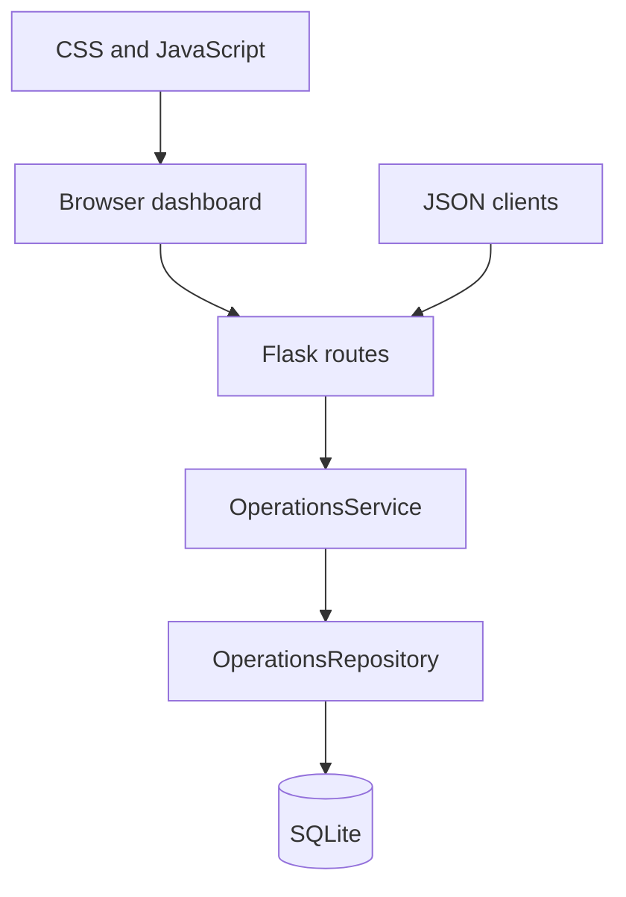

# Architecture

## Design Goal

Provide a small operations dashboard that a reviewer can run locally and inspect without any external service, login, private queue or production dataset.

## Components

## Data Flow

1. The app factory initializes SQLite with deterministic synthetic incidents.
2. The dashboard fetches summary and incident JSON endpoints.
3. The repository calculates SLA state from incident age and SLA target.
4. Transition endpoints update incident state.
5. The demo ingestion endpoint creates a new fictional incident for UI testing.

## Boundaries

- Flask is used because this project is a compact dashboard/UI lab.
- SQLite is enough for local reproducibility and deterministic tests.
- There is no authentication layer because the project is a local portfolio demo, not a deployed multi-user service.
- All queues, incidents, assets and trend points are fictional.

